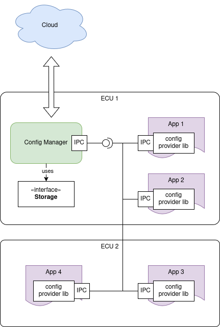
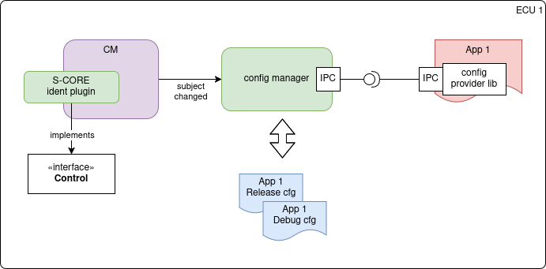
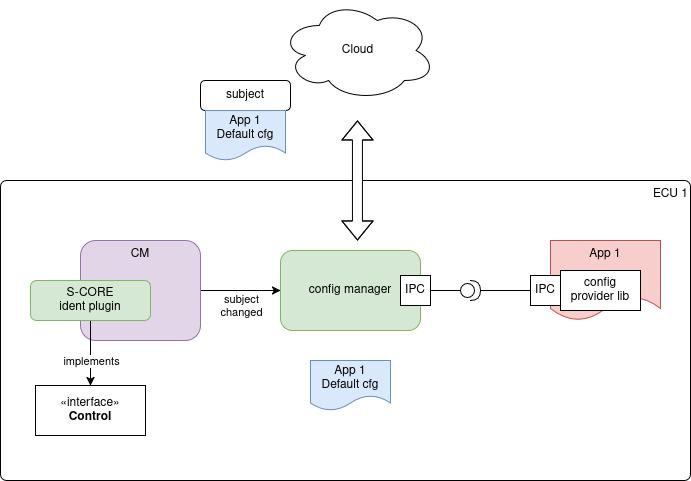

# Config management module

## Overview

This document describes the architecture of the AosCore Config Manager and explains how it aligns with S-CORE
requirements to enable its integration within the S-CORE framework.

## AosCore architecture

AosCore implements a centralized Config Manager to enable applications to store and retrieve their configuration data.

Config Manager Inter-process communication (IPC) in AosCore is implemented as a plugin, allowing the use of different
libraries and IPC mechanisms across various platforms.

Config Manager utilizes the `Storage` interface to store application configurations. This approach enables the use of
different storage mechanisms and devices across various platforms. For example, on Linux, it may use SQLite for
configuration management, while on bare-metal devices, it can access raw EEPROM directly.

## States usage

In AosCore terminology, application configuration is considered equivalent to `state`.

In addition to meeting S-CORE requirements for storing and retrieving application configuration at runtime, the AosCore
Config Manager offers extended functionality that leverages cloud communication capabilities. For example, it can:

* deploy default configurations from the cloud based on specific circumstances, such as providing different application
  configurations for different regions;
* deploy different application configurations for different `Run Target`. For example, the application may have
  different configuration in debug target;
* upload the current application configuration to the cloud for reuse on another unit. For example, this enables a
  driver to stop listening to music at a specific position in one car and resume playback from the same position in
  another vehicle.

### Binding config to Run Target

These functionalities are implemented using the AosCore subjects mechanism. Each application is bound to a specific
subject. The same application can be launched multiple times for different subjects, with each instance maintaining its
own configuration.

### Deploy default config by cloud

The cloud can provide different configurations for an application based on its bound subject. The default configuration
may also be modified by the application at runtime.

See https://docs.aosedge.tech/docs/aos-cloud/components-view/state-management%20component for more details.
